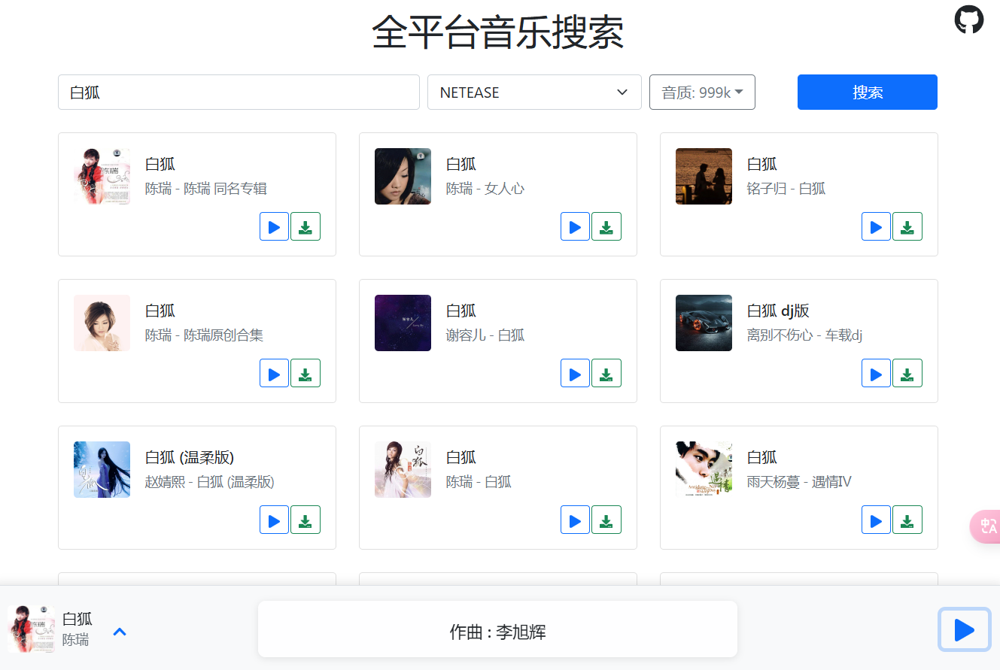
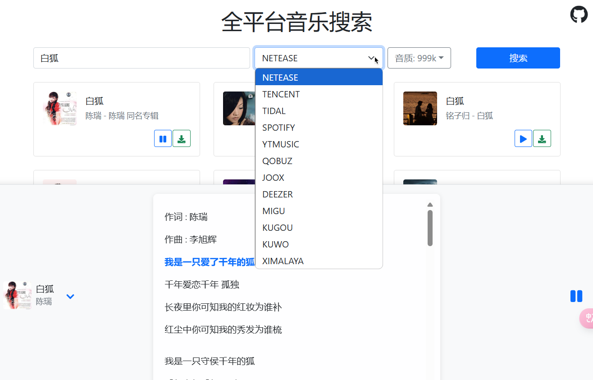
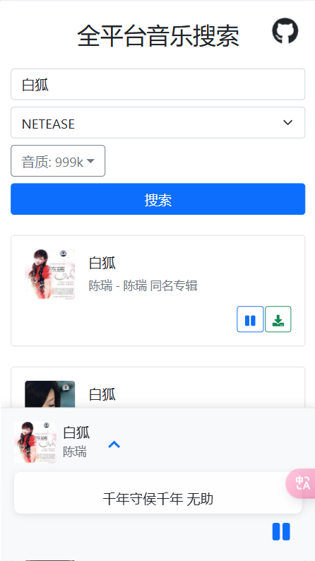

# SonicFlow (CL-Music) 全平台音乐搜索

一款基于React开发的在线音乐搜索和播放应用。
[](https://app.netlify.com/sites/cl-music/deploys)  [](https://vercel.com)








## 功能特点

- 🎵 支持多平台音乐搜索

  - 网易云音乐
  - QQ音乐
  - TIDAL
  - Spotify
  - YouTube Music
  - Qobuz
  - JOOX
  - Deezer
  - 咪咕音乐
  - 酷狗音乐
  - 酷我音乐
  - 喜马拉雅
  
- 🎨 主要功能

  - 音乐搜索
  - 在线播放
  - 音乐下载（支持直接下载、无损音质）
  - 音质选择(最高支持999k无损FLAC)
  - 歌词显示(支持双语歌词、当前行+下一行预览)
  - 专辑封面显示
  - 收藏功能（红心标记喜爱的歌曲）
  - 收藏歌单导入/导出（支持跨平台歌曲匹配）
  - 批量下载收藏歌曲（支持无损音质）
  - 播放历史记录
  - 响应式设计和优化的用户界面

## 最新改进

- 📱 **双模式音乐播放器**
  - 紧凑底栏模式：不干扰内容浏览
  - 全屏沉浸模式：提供完整的音乐和歌词体验
  - 平滑过渡动画和暗色背景提升视觉体验
  - 适当的内容页底部间距，避免播放器遮挡内容

- 🎯 **优化的页面布局与卡片设计**
  - 统一的网格布局，各页面保持一致的卡片显示风格
  - 细腻的卡片间距与布局调整，提供更好的视觉体验
  - 历史记录页面优化，时间戳布局改进为更直观的设计

- 📦 **PWA支持与离线功能**
  - 支持安装为本地应用（手机和桌面端）
  - 添加到主屏幕，提供类原生应用体验
  - 离线访问核心功能，随时随地享受音乐

- 📱 **移动端适配优化**
  - 竖屏使用提示
  - 响应式布局在不同屏幕尺寸下自动优化
  - 触控友好的操作界面

- 🎵 **歌词显示增强**
  - 同时显示当前歌词行和下一句歌词
  - 自动高亮当前播放位置
  - 歌词展开/折叠优化
  - 支持歌词自动滚动

- 💾 **下载功能完善**
  - 支持直接下载，无需跳转
  - 无损FLAC格式支持
  - 批量下载收藏歌曲
  - 完善的下载状态反馈

- 🎨 **界面设计改进**
  - 导航栏视觉优化
  - 动画效果增强与交互反馈
  - 移动端响应式布局优化
  - 卡片样式与转场动画美化

## 功能详解

- 💖 **收藏功能**
  - 一键收藏喜爱的歌曲
  - 在播放控制栏直接添加/移除收藏
  - 查看和管理所有收藏的歌曲

- 📤 **收藏导入/导出**
  - 导出收藏列表为JSON文件
  - 导入之前导出的收藏文件
  - 跨平台智能匹配歌曲（即使从不同音乐平台导入也能自动匹配对应歌曲）

- 📜 **历史记录**
  - 自动记录播放过的歌曲
  - 按时间排序显示历史记录
  - 一键清空历史记录

- 🎨 **UI优化**
  - 美化的导航栏和品牌标识
  - 响应式卡片布局
  - 直观的按钮和图标
  - 流畅的过渡动画

## 项目部署
 生产环境需配置一个环境编辑，`REACT_APP_API_BASE` 后端API地址，由于跨域问题不可以直接使用，一般填写反代 `https://music-api.gdstudio.xyz/api.php` 后地址，可使用nginx、caddy 等web服务反代，也可是cloudflare worker反代，我这边提供了worker反向代理的代码，见 [worker.js](worker.js)
    可快速部署到 netlify 、vercel、Cloudflare Pages 等平台。[](https://vercel.com/new/clone?repository-url=thttps%3a%2f%2fgithub.com%2flovebai%2fcl-music&project-name=cl-music&repository-name=cl-music)  [](https://app.netlify.com/start/deploy?repository=https://github.com/lovebai/cl-music)

**Docker部署**
  - docker 

     ```shell
     docker run -d -p 80:80 --restart always ghcr.io/lovebai/cl-music:0.1.1
     ```
  - docker-compose

```yaml
services:
    lovebai:
        image: ghcr.io/lovebai/cl-music:0.1.1
        restart: always
        ports:
            - '80:80'
```

## 技术栈

- React
- React Bootstrap
- Axios
- React Player
- React Icons
- React Toastify
- Localforage (本地数据存储)
- Moment.js (日期格式化)

## 本地开发

1. 克隆项目

```bash
git clone https://github.com/voici5986/cl_music_X.git
```

2. 安装依赖

```bash
cd cl-music
npm install
```

3. 启动开发服务器

```bash
npm start
```

4. 打开浏览器访问 `http://localhost:3000`

## 构建部署

构建生产版本：

```bash
npm run build
```

## 项目结构

```
cl-music/
    ├── public/              # 静态文件
    ├── src/                 # 源代码
    │   ├── App.js          # 主应用组件
    │   ├── index.js        # 入口文件
    │   ├── components/     # 可复用组件
    │   │   ├── HeartButton.js # 收藏按钮组件
    │   │   ├── Navigation.js  # 导航组件
    │   │   └── ProgressBar.js # 进度条组件
    │   ├── pages/          # 页面组件 
    │   │   ├── Favorites.js  # 收藏页面
    │   │   └── History.js    # 历史记录页面
    │   ├── services/       # 服务
    │   │   └── storage.js    # 本地存储服务
    │   ├── styles/         # 样式文件
    │   │   └── NavigationFix.css # 导航样式修复
    │   └── setupProxy.js   # 开发代理配置
    └── package.json        # 项目配置文件
```

## API接口

项目使用的是第三方音乐API接口，通过setupProxy.js配置代理访问。

后端API接口：`https://music-api.gdstudio.xyz/api.php`

## 许可证

MIT License

## 功能特性

- 音乐搜索与播放
- 在线音乐下载
- 收藏歌曲管理
- 播放历史记录
- 单曲循环/随机播放/列表循环多种播放模式
- 账号登录与数据同步
  - 多设备收藏和历史记录云端同步
